## 导入库

```
一般使用下面这个模块
import numpy as np
import matplotlib.pyplot as plt
或者是
from pylab import *
matplotlib.__version__===>这里使用的版本是3.5.3,版本过低有些功能可能不一定
注意对python 版本也有要求
 python[version='>=3.10,<3.11.0a0|>=3.9,<3.10.0a0|>=3.7,<3.8.0a0|>=3.8,<3.9.0a0']
```

## pyplot与pylab的区别

```
对Pyplot的解说：“方便快速绘图matplotlib通过pyplot模块提供了一套和MATLAB类似的绘图API，将众多绘图对象所构成的复杂结构隐藏在这套API内部。”

对pylab的解说：“matplotlib还提供了一个名为pylab的模块，其中包括了许多NumPy和pyplot模块中常用的函数，方便用户快速进行计算和绘图，十分适合在IPython交互式环境中使用。

意思就是说pylab结合了pyplot和numpy，对交互式使用来说比较方便，既可以画图又可以进行简单的计算。但是，对于一个项目来说，建议分别倒入使用。

项目使用这个===>之后所有案例都以这个为例
import numpy as np
import matplotlib.pyplot as plt
```


## pyplot 模块介绍

### 绘图类型

| 函数名称  | 描述                                       |
| --------- | ------------------------------------------ |
| Bar       | 绘制条形图                                 |
| Barh      | 绘制水平条形图                             |
| Boxplot   | 绘制箱型图                                 |
| Hist      | 绘制直方图                                 |
| his2d     | 绘制2D直方图                               |
| Pie       | 绘制饼状图                                 |
| Plot      | 在坐标轴上画线或者标记                     |
| Polar     | 绘制极坐标图                               |
| Scatter   | 绘制x与y的散点图                           |
| Stackplot | 绘制堆叠图                                 |
| Stem      | 用来绘制二维离散数据绘制（又称为“火柴图”） |
| Step      | 绘制阶梯图                                 |
| Quiver    | 绘制一个二维按箭头                         |

### Image函数

| 函数名称 | 描述                               |
| -------- | ---------------------------------- |
| Imread   | 从文件中读取图像的数据并形成数组。 |
| Imsave   | 将数组另存为图像文件。             |
| Imshow   | 在数轴区域内显示图像。             |

### Axis函数

| 函数名称 | 描述                          |
| -------- | ----------------------------- |
| Axes     | 在画布(Figure)中添加轴        |
| Text     | 向轴添加文本                  |
| Title    | 设置当前轴的标题              |
| Xlabel   | 设置x轴标签                   |
| Xlim     | 获取或者设置x轴区间大小       |
| Xscale   | 设置x轴缩放比例               |
| Xticks   | 获取或设置x轴刻标和相应标签   |
| Ylabel   | 设置y轴的标签                 |
| Ylim     | 获取或设置y轴的区间大小       |
| Yscale   | 设置y轴的缩放比例             |
| Yticks   | 获取或设置y轴的刻标和相应标签 |

### Figure函数

| 函数名称 | 描述             |
| -------- | ---------------- |
| Figtext  | 在画布上添加文本 |
| Figure   | 创建一个新画布   |
| Show     | 显示数字         |
| Savefig  | 保存当前画布     |
| Close    | 关闭画布窗口     |

### hello matplotlib

```
x = np.arange(0, math.pi * 2, 0.05)--->创建一个从0到2派步长为0.05的一维数组
y = np.sin(x)
plt.plot(x, y)	--->Plot在坐标轴上画线,将所有点用直线连接起来
plt.xlabel("angle")	 -->图像的标题(title)、x 轴与 y 轴的标签（label）
plt.ylabel("sine")   
plt.title('sine wave') 
# 使用show展示图像
plt.show()
```

## 创建画布

```
x = np.arange(0, math.pi*2, 0.05)
y = np.sin(x)
# 创建一个空白画布
fig = plt.figure()
# add_axes() 将 axes 轴域添加到画布
#接受一个由4个元素组成的浮点数列表，形如 [left, bottom, width, height] ，它表示添加到画布中的矩形区域的左下角坐标(x, y)，以及宽度和高度
#每个元素的值是画布宽度和高度的分数。即将画布的宽、高作为 1 个单位。比如，[ 0.1, 0.1, 0.8, 0.8]，它代表着从画布 10% 的位置开始绘制, 宽高是画布的 80%。
ax = fig.add_axes([0,0,1,1])
ax.plot(x,y)
ax.set_title("sine wave")
ax.set_xlabel('angle')
ax.set_ylabel('sine')
plt.show()
```

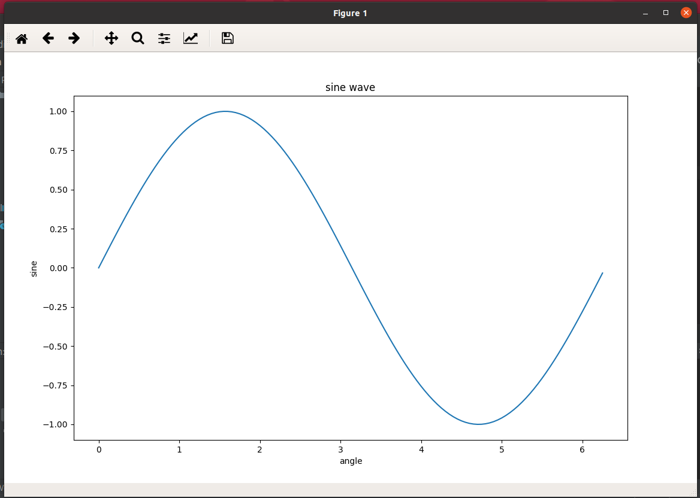

## axes类

```
axes涉及的函数和属性(看库文件获得)
add_artist
add_child_axes
add_collection
add_container
add_image
add_line
add_patch
add_table
apply_aspect
ArtistList
insert
artists
autoscale
autoscale_view
handle_single_axis
axes
axis
axison
bbox
callbacks
can_pan
can_zoom
child_axes
cla
clear
collections
containers
contains
contains_point
dataLim
drag_pan
drag_pan
draw
draw_artist
end_pan
fmt_xdata
fmt_ydata
format_coord
format_xdata
format_ydata
get_adjustable
get_anchor
get_aspect
get_autoscalex_on
get_autoscaley_on
get_autoscale_on
get_axes_locator
get_axisbelow
get_box_aspect
get_children
get_data_ratio
get_default_bbox_extra_artists
get_facecolor
get_frame_on
get_images
get_legend
get_lines
get_navigate
get_navigate_mode
get_position
get_rasterization_zorder
get_renderer_cache
get_shared_x_axes
get_shared_y_axes
get_tightbbox
get_window_extent
get_xaxis
get_xaxis_text1_transform
get_xaxis_text2_transform
get_xaxis_transform
get_xbound
get_xgridlines
get_xlabel
get_xlim
get_xmajorticklabels
get_xminorticklabels
get_xscale
get_xticklabels
get_xticklines
get_xticks
get_yaxis
get_yaxis_text1_transform
get_yaxis_text2_transform
get_yaxis_transform
get_ybound
get_ygridlines
get_ylabel
get_ylim
get_ymajorticklabels
get_yminorticklabels
get_yscale
get_yticklabels
get_yticklines
get_yticks
grid   --->设置网格是否开启
has_data
ignore_existing_data_limits
images
invert_xaxis
invert_yaxis
in_axes
legend_
lines
locator_params
margins
minorticks_off
minorticks_on
name
patch
patches
redraw_in_frame
relim
reset_position
set_adjustable
set_anchor
set_aspect
set_autoscalex_on
set_autoscaley_on
set_autoscale_on
set_axes_locator
set_axisbelow
set_axis_off
set_axis_on
set_box_aspect
set_facecolor --->设置背景颜色
set_figure
set_frame_on
set_navigate
set_navigate_mode
set_position
set_prop_cycle
set_rasterization_zorder
set_xbound
set_xlabel  --->设置x轴标签
set_xlim	--->设置x轴区间大小
set_xmargin
set_xscale  --->设置x轴缩放比例
set_xticklabels  --->设置x轴刻度标签
set_xticks  --->设置x轴刻度和相应标签
set_ybound
set_ylabel --->设置y轴标签
set_ylim   --->设置y轴区间大小
set_ymargin
set_yscale --->设置y轴缩放比例
set_yticklabels --->设置y轴刻度标签
set_yticks  --->设置y轴刻度和相应标签
sharex
sharey
spines
stale
start_pan
tables
texts
ticklabel_format
tick_params
title
titleOffsetTrans
transAxes
transData
transLimits
transScale
twinx
twiny
update_datalim
use_sticky_edges
use_sticky_edges
viewLim
xaxis
xaxis.labelpad
xaxis.major
xaxis.minor
xaxis._scale
xaxis_date
xaxis_inverted
yaxis
yaxis.labelpad
yaxis.major
yaxis.minor
yaxis._scale
yaxis_date
yaxis_inverted
format_deltas
attr_name
method_name
wrapper
axes
command
get_next_color
prop_cycler
set_prop_cycle
Artist
martist
MutableSequence
```


### legend()绘制图例

```
ax.legend(handles, labels, loc)
labels 是一个字符串序列，用来指定标签的名称；
loc 是指定图例位置的参数，其参数值可以用字符串或整数来表示；
handles 参数，它也是一个序列，它包含了所有线型的实例；


y = [1, 4, 9, 16, 25,36,49, 64]
x1 = [1, 16, 30, 42,55, 68, 77,88]
x2 = [1,6,12,18,28, 40, 52, 65]
fig = plt.figure()
ax = fig.add_axes([0,0,1,1])
#使用简写的形式color/标记符/线型
l1 = ax.plot(x1,y,'ys-') 
l2 = ax.plot(x2,y,'go--') 
ax.legend(handles=[*l2,*l1],labels = ('tv', 'Smartphone'), loc = 'lower right') # legend placed at lower right
ax.set_title("Advertisement effect on sales")
ax.set_xlabel('medium')
ax.set_ylabel('sales')
plt.show()


ax.legend(labels = ('tv', 'Smartphone'), loc = 'lower right')
handles不写默认是ax.plot绘制的顺序即*l1,*l2
```

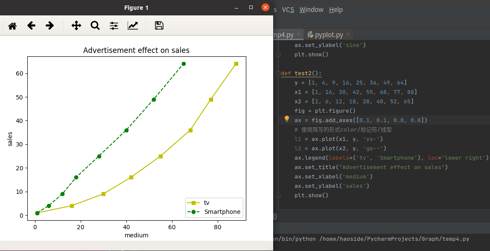

## 常见函数

### subplot与subplots函数

```
plt.subplot(nrows, ncols, index)
fig , ax = plt.subplots(nrows, ncols)

matplotlib.pyplot模块提供了一个 subplots() 函数，它的使用方法和 subplot() 函数类似。其不同之处在于，subplots() 既创建了一个包含子图区域的画布，又创建了一个 figure 图形对象，而 subplot() 只是创建一个包含子图区域的画布。

函数的返回值是一个元组，包括一个图形对象和所有的 axes 对象。其中 axes 对象的数量等于 nrows * ncols，且每个 axes 对象均可通过索引值访问（从1开始）
```

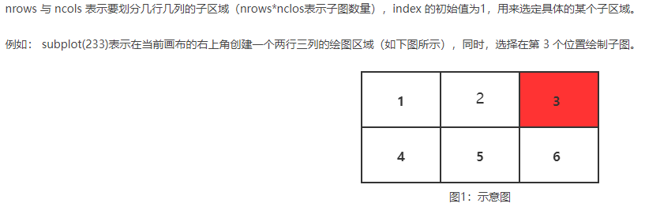

```
# 创建一个子图，它表示一个有2行1列的网格的顶部图。
plt.subplot(211)
plt.plot(range(12))
# 创建带有黄色背景的第二个子图
plt.subplot(212, facecolor='y')
plt.plot(range(12))
plt.show()
```

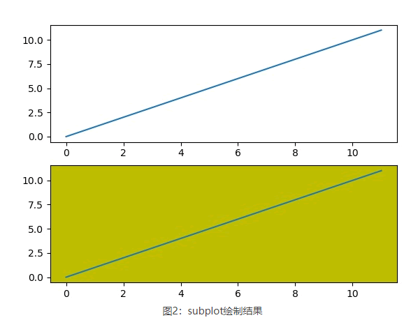

```
#add_subplot-->不进行覆盖
fig = plt.figure()
ax1 = fig.add_subplot(111)
ax1.plot([1,2,3])
ax2 = fig.add_subplot(221, facecolor='y')
ax2.plot([1,2,3])
```

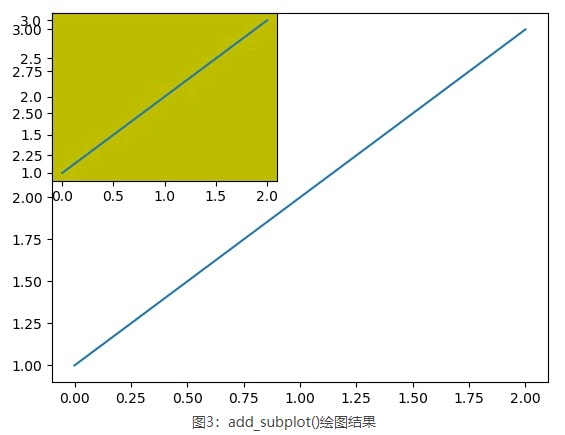

```
#通过给画布添加 axes 对象可以实现在同一画布中插入另外的图像
x = np.arange(0, math.pi*2, 0.05)
fig=plt.figure()
axes1 = fig.add_axes([0.1, 0.1, 0.8, 0.8]) # main axes
axes2 = fig.add_axes([0.55, 0.55, 0.3, 0.3]) # inset axes
y = np.sin(x)
axes1.plot(x, y, 'b')
axes2.plot(x,np.cos(x),'r')
axes1.set_title('sine')
axes2.set_title("cosine")
plt.show()
```

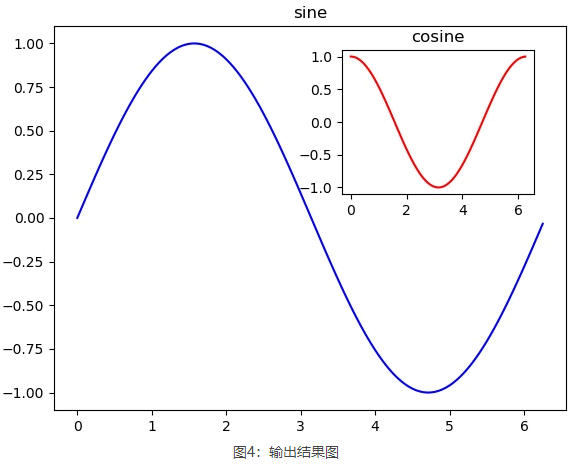

```
fig,a =  plt.subplots(2,2)
x = np.arange(1,5)
#绘制平方函数
a[0][0].plot(x,x*x)
a[0][0].set_title('square')
#绘制平方根图像
a[0][1].plot(x,np.sqrt(x))
a[0][1].set_title('square root')
#绘制指数函数
a[1][0].plot(x,np.exp(x))
a[1][0].set_title('exp')
#绘制对数函数
a[1][1].plot(x,np.log10(x))
a[1][1].set_title('log')
plt.show()


plt.subplots(2,1)或者(1,2)==>是一维数组a[0],a[1]表示即可
不懂print(a,*a)-->就知道是啥了
```

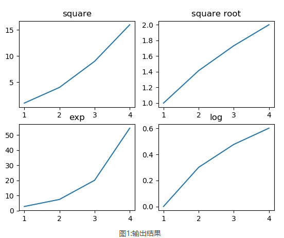

### subplot2grid函数

```
plt.subplot2grid(shape, location, rowspan, colspan)
	该函数能够在画布的特定位置创建 axes 对象（即绘图区域）。不仅如此，它还可以使用不同数量的行、列来创建跨度不同的绘图区域。与 subplot() 和 subplots() 函数不同，subplot2gird() 函数以非等分的形式对画布进行切分，并按照绘图区域的大小来展示最终绘图结果。

参数含义如下：
shape：把该参数值规定的网格区域作为绘图区域；
location：在给定的位置绘制图形，初始位置 (0,0) 表示第1行第1列；
rowsapan/colspan：这两个参数用来设置让子区跨越几行几列。

a1 = plt.subplot2grid((3,3),(0,0),colspan = 2)==>跨越两列
a2 = plt.subplot2grid((3,3),(0,2), rowspan = 3)==>跨越三行
a3 = plt.subplot2grid((3,3),(1,0),rowspan = 2, colspan = 2)==>跨越两行两列
x = np.arange(1,10)
a2.plot(x, x*x)
a2.set_title('square')
a1.plot(x, np.exp(x))
a1.set_title('exp')
a3.plot(x, np.log(x))
a3.set_title('log')
plt.tight_layout()
plt.show()
```

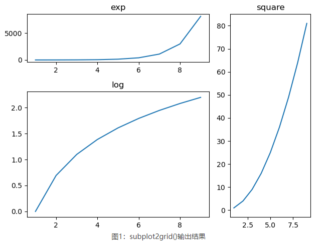

## 常见设置方式

```
1.设置网格格式
grid(color='b', ls = '-.', lw = 0.25)

参数含义如下：
color：表示网格线的颜色；
ls：表示网格线的样式；
lw：表示网格线的宽度；

#fig画布；axes子图区域
#figsize 指定画布的大小，(宽度,高度)，单位为英寸

fig, axes = plt.subplots(1,3, figsize = (12,4))
x = np.arange(1,11)
axes[0].plot(x, x**3, 'g',lw=2)
#开启网格
axes[0].grid(True)
axes[0].set_title('default grid')
axes[1].plot(x, np.exp(x), 'r')
#设置网格的颜色，线型，线宽
axes[1].grid(color='b', ls = '-.', lw = 0.25)
axes[1].set_title('custom grid')
axes[2].plot(x,x)
axes[2].set_title('no grid')
fig.tight_layout()
plt.show()

2.设置坐标轴格式
Matplotlib 通过 axes 对象的xscale或yscale属性来实现对坐标轴的格式设置
fig, axes = plt.subplots(1, 2, figsize=(10,4))
x = np.arange(1,5)
axes[0].plot( x, np.exp(x))
axes[0].plot(x,x**2)
axes[0].set_title("Normal scale")
axes[1].plot (x, np.exp(x))
axes[1].plot(x, x**2)
#设置y轴
axes[1].set_yscale("log")
axes[1].set_title("Logarithmic scale (y)")
axes[0].set_xlabel("x axis")
axes[0].set_ylabel("y axis")
axes[0].xaxis.labelpad = 10 ===>距离x轴位置,-向上+向下
#设置x、y轴标签
axes[1].set_xlabel("x axis")
axes[1].set_ylabel("y axis")
plt.show()


fig = plt.figure()
ax = fig.add_axes([0,0,1,1])
#为左侧轴，底部轴添加颜色
ax.spines['bottom'].set_color('blue')
ax.spines['left'].set_color('red')
ax.spines['left'].set_linewidth(2)
#将侧轴、顶部轴设置为None
ax.spines['right'].set_color(None)
ax.spines['top'].set_color(None)
ax.plot([1,2,3,4,5])
plt.show()
```

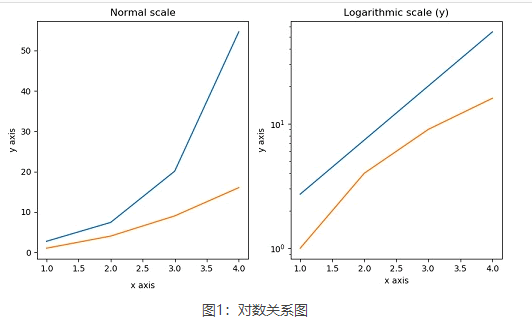

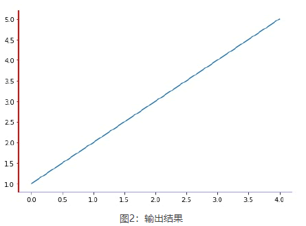

```
设置坐标轴范围
通过 set_xlim() 和 set_ylim() 对 x、y 轴的数值范围进行设置
fig = plt.figure()
# 添加绘图区域
a1 = fig.add_axes([0.1, 0.1, 0.8,0.8])
# 准备数据
x = np.arange(1, 10)
# 绘制函数图像
a1.plot(x, np.exp(x))
# 添加题目
a1.set_title('exp')
a1.set_xlim(0,10)
a1.set_ylim(0,10000)
plt.show()

设置刻度和刻度标签
	刻度指的是轴上数据点的标记，Matplotlib 能够自动的在 x 、y 轴上绘制出刻度。这一功能的实现得益于 Matplotlib 内置的刻度定位器和格式化器（两个内建类）。在大多数情况下，这两个内建类完全能够满足我们的绘图需求，但是在某些情况下，刻度标签或刻度也需要满足特定的要求，比如将刻度设置为“英文数字形式”或者“大写阿拉伯数字”，此时就需要对它们重新设置。
x = np.arange(0, math.pi * 2, 0.05)
# 生成画布对象
fig = plt.figure()
# 添加绘图区域
ax = fig.add_axes([0.1, 0.1, 0.8, 0.8])
y = np.sin(x)
ax.plot(x, y)
# 设置x轴标签
ax.set_xlabel('angle')
ax.set_title('sine')
ax.set_xticks([0, 2, 4, 6])
# 设置x轴刻度标签
ax.set_xticklabels(['zero', 'two', 'four', 'six'])
# 设置y轴刻度
ax.set_yticks([-1, 0, 1])
ax.set_yticklabels(["very small","zero","very big"])
plt.show()
    
    
Matplotlib显示中文字体===>http://c.biancheng.net/matplotlib/9284.html
fc-list :lang=zh ubuntu查看安装了那些字体
```

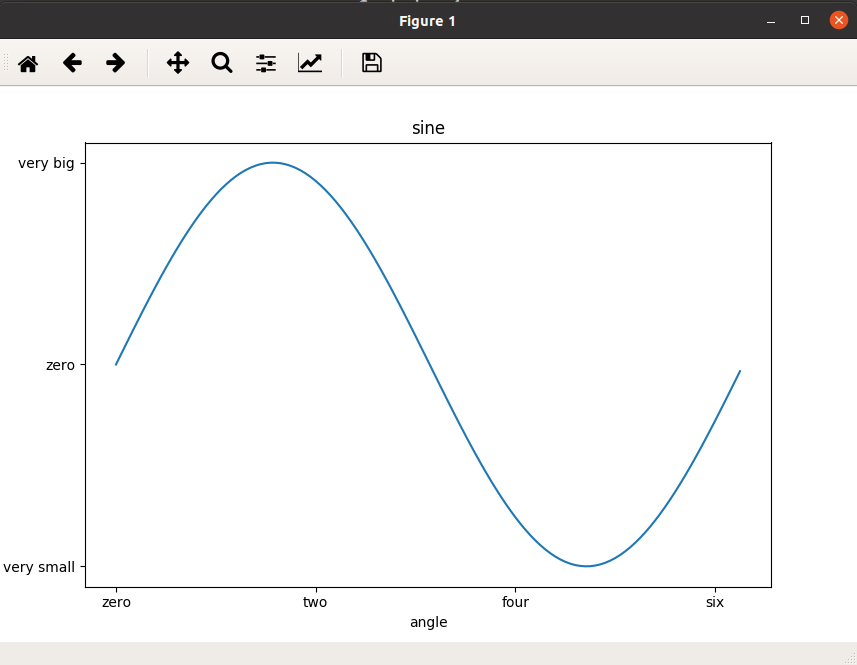

### 显示中文字体

#### windows

设置显示中文字体,linux类似,字体在当前目录下的fonts里面

```
import matplotlib
matplotlib.matplotlib_fname()
===>得到配置文件路径
```


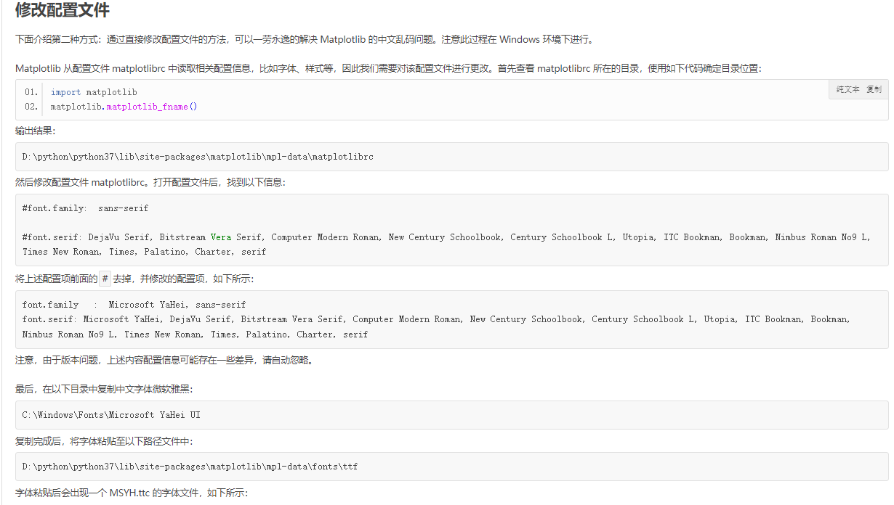

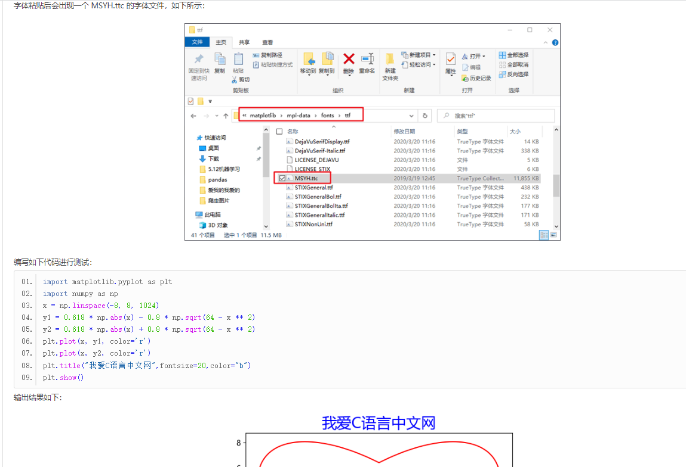


#### ubuntu

```
1.将./font目录下的字体复制到配置文件路径下的font文件夹下
2.修改matplotlibrc
font.family:  Microsoft YaHei,simhei,sans-serif

font.serif: Microsoft YaHei,simhei,DejaVu Serif, Bitstream Vera Serif, Computer Modern Roman, New Century Schoolbook, Century Schoolbook L, Utopia, ITC Bookman, Bookman, Nimbus Roman No9 L, Times New Roman, Times, Palatino, Charter, serif
```


## 折线图

根据点,利用plot直线连接,画折线图

```
x = np.linspace(-3,3,50)
print(x)
y = x ** 2
plt.plot(x, y,"r:.")点线+点+红色
plt.show()

plot第三个参数为线型、标记和颜色设置
| 线型     | 说明   |
| -------- | ------ |
| - (默认) | 实线   |
| --       | 虚线   |
| :        | 点线   |
| -.       | 点划线 |
| 标记         | 说明     |
| ------------ | -------- |
| none（默认） | 不显示   |
| o            | 圆圈     |
| +            | 加号     |
| *            | 星号     |
| .            | 点       |
| x            | 叉号     |
| _            | 水平线条 |
| \|           | 垂直线条 |
| s            | 方形     |
| d            | 菱形     |
| ^            | 上三角   |
| v            | 下三角   |
| >            | 右三角   |
| <            | 左三角   |
| p            | 五角形   |
| h            | 六角形   |
| 颜色 | 说明      |
| ---- | :-------- |
| r    | 红色      |
| g    | 绿色      |
| b    | 蓝色      |
| w    | 白色      |
| k    | 黑色      |
| y    | 黄色      |
| m    | 品红/洋红 |
| c    | 青蓝      |
其他功能可查看
https://blog.csdn.net/weixin_46098577/article/details/119520546
相关代码可查看
.\code\matplotlib\matplotlib_1.py


# 准备绘制数据
x = ["Mon", "Tues", "Wed", "Thur", "Fri", "Sat", "Sun"]
y = [20, 40, 35, 55, 42, 80, 50]
# "g" 表示红色，marksize用来设置'D'菱形的大小
plt.plot(x, y, "g", marker='d', markersize=5, label="周活")
# 绘制坐标轴标签
plt.xlabel("登录时间")
plt.ylabel("用户活跃度")
plt.title("C语言中文网活跃度")
# 显示图例
plt.legend(loc="lower right")
# 调用 text()在图像上绘制注释文本
# x1、y1表示文本所处坐标位置，ha参数控制水平对齐方式, va控制垂直对齐方式，str(y1)表示要绘制的文本
print(*zip(x, y))
for x1, y1 in zip(x, y):
plt.text(x1, y1, str(y1), ha='center', va='bottom', fontsize=10)
# 保存图片
plt.savefig("./1.jpg")
plt.show()
```

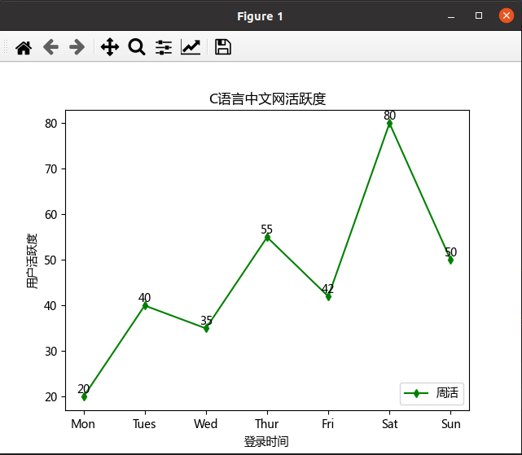

### 绘制多条折线图

```
x = [5, 8, 12, 14, 16, 18, 20]
y1 = [18, 21, 29, 31, 26, 24, 20]
y2 = [15, 18, 24, 30, 31, 25, 24]
#绘制折线图，添加数据点，设置点的大小
# * 表示绘制五角星；此处也可以不设置线条颜色，matplotlib会自动为线条添加不同的颜色
plt.plot(x, y1, 'r',marker='*', markersize=10)
plt.plot(x, y2, 'b', marker='*',markersize=10)
plt.title('温度对比折线图')  # 折线图标题
plt.xlabel('时间(h)')  # x轴标题
plt.ylabel('温度(℃)')  # y轴标题
#给图像添加注释，并设置样式
for a, b in zip(x, y1):
    plt.text(a, b, b, ha='center', va='bottom', fontsize=10)
for a, b in zip(x, y2):
    plt.text(a, b, b, ha='center', va='bottom', fontsize=10)
#绘制图例
plt.legend(['第一天', '第二天'])
#显示图像
plt.show()
```

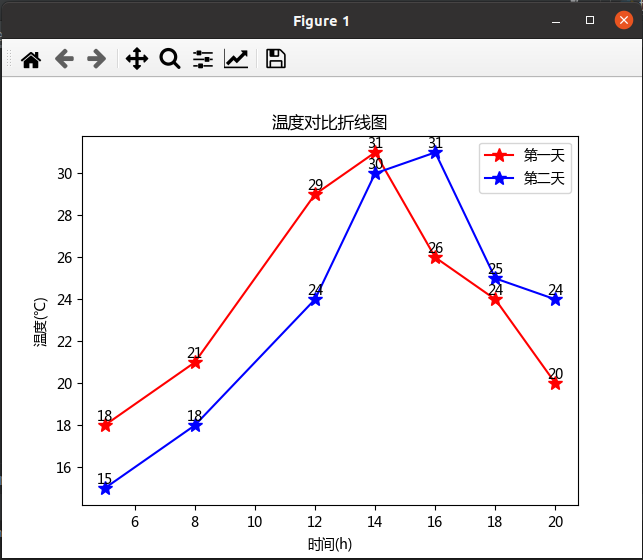

## 双轴图

```
# 创建图形对象
fig = plt.figure(figsize=[12,6])
# 添加子图区域
a1 = fig.add_axes([0.1, 0.1, 0.8, 0.8])
# 准备数据
x = np.arange(1, 11)
# 绘制指数函数
l1=a1.plot(x, np.exp(x))
a1.set_ylabel('exp')
# 添加双轴
a2 = a1.twinx()
# ‘ro’表示红色圆点
l2=a2.plot(x, np.log(x), 'ro-')
# 绘制对数函数
a2.set_ylabel('log')
# 绘制图例
#注意figure对象设置图例时,需要传入画图的对象,plot返回一个对象,而需要的是对象的值,故需要解引用
#而exis对象使用legend不需要设置handles参数
fig.legend(handles=[*l1,*l2],labels=('exp', 'log'), loc=(0.1,0.8))
plt.show()
```

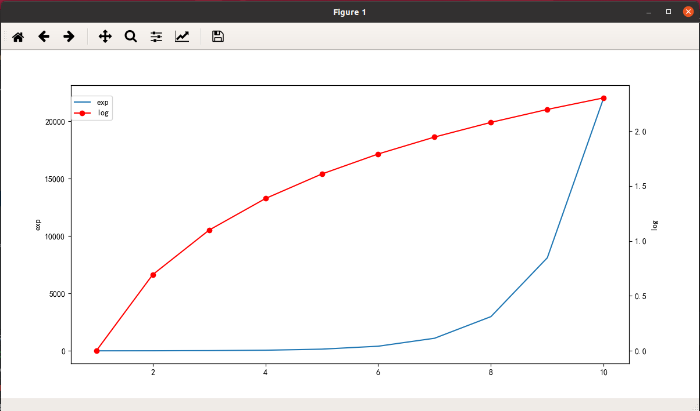

## 柱状图

### 简单柱状图

```
import matplotlib.pyplot as plt
fig = plt.figure()
# 添加子图区域，参数值表示[left, bottom, width, height ]
ax = fig.add_axes([0.1, 0.1, 0.8, 0.8])
# 准备数据
langs = ['C', 'C++', 'Java', 'Python', 'PHP']
# langs=[i for i in range(5)]
# 设置x轴刻度标签
students = [23, 17, 35, 29, 12]
# 绘制柱状图
ax.bar(langs, students)
plt.show()
---------------------------------------------------------------
fig = plt.figure()
# 添加子图区域，参数值表示[left, bottom, width, height ]
ax = fig.add_axes([0.1, 0.1, 0.8, 0.8])
# 准备数据
s = ['C', 'C++', 'Java', 'Python', 'PHP']
langs=[i for i in range(5)]
# 设置x轴刻度标签
students = [23, 17, 35, 29, 12]
# 绘制柱状图
plt.xticks(langs, s)   ===>对于一些老版本如果不能以字符串为x轴,可以这么写
ax.bar(langs, students)
plt.show()

```

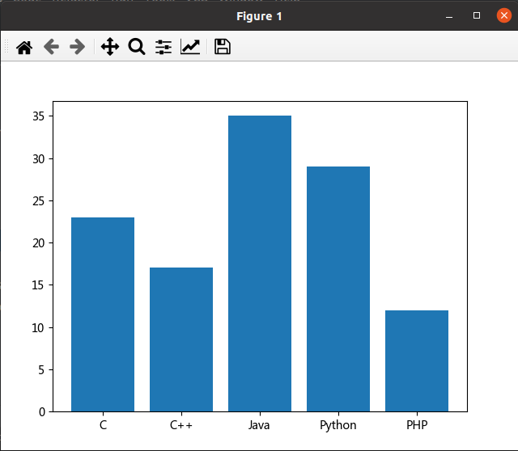

### 同一位置绘制多个柱状图

```python
data = [[30, 25, 50, 20],
[40, 23, 51, 17],
[35, 22, 45, 19]]
X = np.arange(4)
fig = plt.figure()
# 添加子图区域
ax = fig.add_axes([0.1, 0.1, 0.8, 0.8])
# 绘制柱状图
ax.bar(X + 0.00, data[0], color='b', width=0.25)
ax.bar(X + 0.25, data[1], color='g', width=0.25)
ax.bar(X + 0.50, data[2], color='r', width=0.25)
plt.show()
```

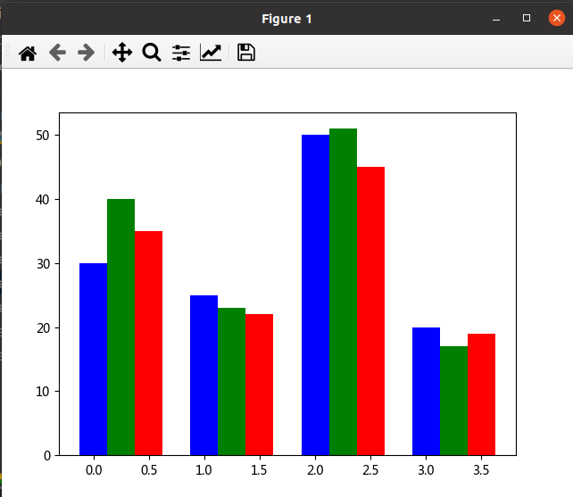

### 柱状堆叠图

```
countries = ['USA', 'India', 'China', 'Russia', 'Germany']
bronzes = np.array([38, 17, 26, 19, 15])
silvers = np.array([37, 23, 18, 18, 10])
golds = np.array([46, 27, 26, 19, 17])
# 此处的 _ 下划线表示将循环取到的值放弃，只得到[0,1,2,3,4]
ind = [x for x, _ in enumerate(countries)]
# 绘制堆叠图
plt.bar(ind, golds, width=0.5, label='golds', color='gold', bottom=silvers + bronzes)
plt.bar(ind, silvers, width=0.5, label='silvers', color='silver', bottom=bronzes)
plt.bar(ind, bronzes, width=0.5, label='bronzes', color='#CD853F')
# 设置坐标轴
plt.xticks(ind, countries)
plt.ylabel("Medals")
plt.xlabel("Countries")
plt.legend(loc="upper right")
plt.title("2019 Olympics Top Scorers")
plt.show()
```

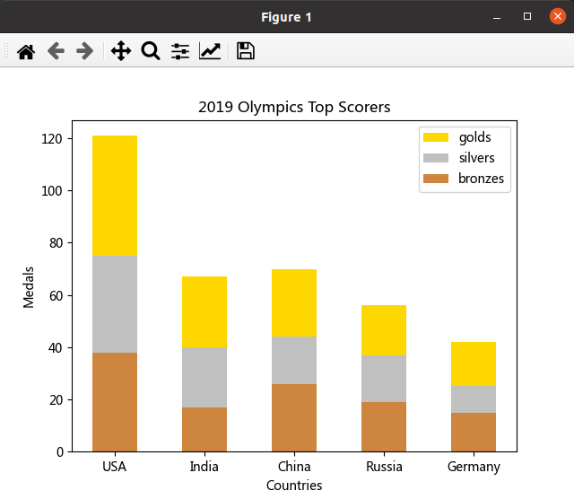

## 直方图

```
matplotlib.pyplot.hist(x, bins=None, range=None, density=False, weights=None,
             cumulative=False, bottom=None, histtype='bar', align='mid',
             orientation='vertical', rwidth=None, log=False,
             color=None, label=None, stacked=False, **kwargs):

该函数的参数说明如下：

x	必填参数，数组或者数组序列。
bins	可选参数，整数或者序列，bins 表示每一个间隔的边缘（起点和终点）默认会生成10个间隔。
range	指定全局间隔的下限与上限值 (min,max)，元组类型，默认值为 None。
density	如果为 True，返回概率密度直方图；默认为 False，返回相应区间元素的个数的直方图。
histtype	要绘制的直方图类型，默认值为“bar”，可选值有 barstacked(堆叠条形图)、step(未填充的阶梯图)、stepfilled(已填充的阶梯图)。

from matplotlib import pyplot as plt
import numpy as np
#创建图形对象和轴域对象
fig,ax = plt.subplots(1,1)
a = np.array([22,87,5,43,56,73,55,54,11,20,51,5,79,31,27])
#绘制直方图
ax.hist(a, bins = [0,25,50,75,100])
#设置坐标轴
ax.set_title("histogram of result")
ax.set_xticks([0,25,50,75,100])
ax.set_xlabel('marks')
ax.set_ylabel('no.of students')
plt.show()
```

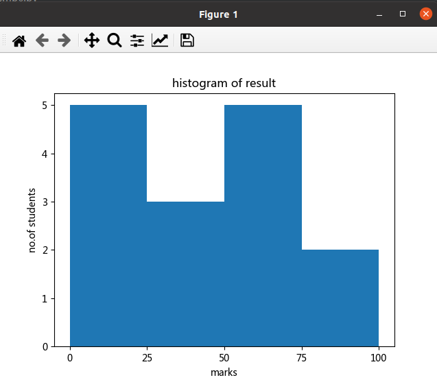


## 饼状图

```
Matplotlib 提供了一个 pie() 函数，该函数可以生成数组中数据的饼状图。您可使用 x/sum(x) 来计算各个扇形区域占饼图总和的百分比。pie() 函数的参数说明如下：

X	数组序列，数组元素对应扇形区域的数量大小。
labels	列表字符串序列，为每个扇形区域备注一个标签名字。
color	为每个扇形区域设置颜色，默认按照颜色周期自动设置。
autopct	格式化字符串"fmt%pct"，使用百分比的格式设置每个扇形
区的标签，并将其放置在扇形区内。

# 添加图形对象
fig = plt.figure()
ax = fig.add_axes([0, 0, 1, 1])
# 使得X/Y轴的间距相等
ax.axis('equal')
# 准备数据
langs = ['C', 'C++', 'Java', 'Python', 'PHP']
students = [23, 17, 35, 29, 12]
# 绘制饼状图
ax.pie(students, labels=langs, autopct='%1.2f%%')
plt.show()
```

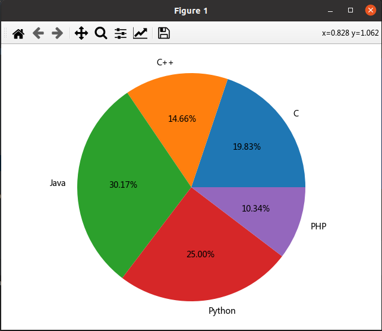

## 散点图

```
girls_grades = [89, 90, 70, 89, 100, 80, 90, 100, 80, 34]
boys_grades = [30, 29, 49, 48, 100, 48, 38, 45, 20, 30]
grades_range = [10, 20, 30, 40, 50, 60, 70, 80, 90, 100]
fig=plt.figure()
#添加绘图区域
ax=fig.add_axes([0.1,0.1,0.8,0.8])
ax.scatter(grades_range, girls_grades, color='r',label="girls")
ax.scatter(grades_range, boys_grades, color='b',label="boys")
ax.set_xlabel('Grades Range')
ax.set_ylabel('Grades Scored')
ax.set_title('scatter plot')
#添加图例
plt.legend()
plt.show()
```

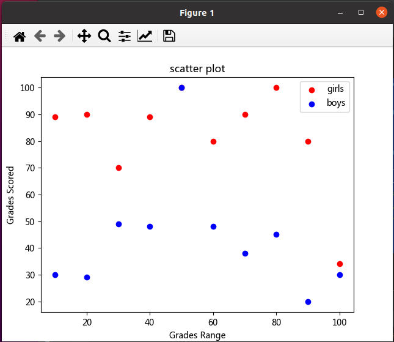

## 等高线图

```
#创建xlist、ylist数组
xlist = np.linspace(-3.0, 3.0, 100)
ylist = np.linspace(-3.0, 3.0, 100)
#将上述数据变成网格数据形式
X, Y = np.meshgrid(xlist, ylist)
#定义Z与X,Y之间的关系
Z = np.sqrt(X**2 + Y**2)
fig,ax=plt.subplots(1,1)
#填充等高线颜色
cp = ax.contourf(X, Y, Z)
fig.colorbar(cp) # 给图像添加颜色柱
ax.set_title('Filled Contours Plot')
ax.set_xlabel('x (cm)')
ax.set_ylabel('y (cm)')
#画等高线
plt.contour(X,Y,Z)
plt.show()
```

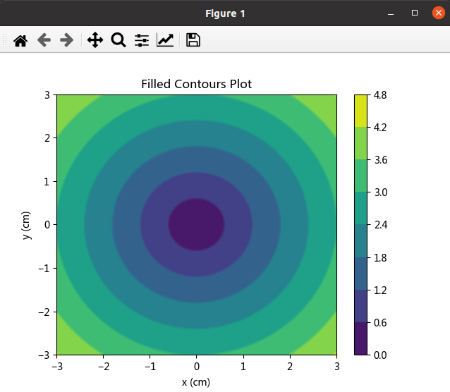

## 振动图

```
quiver(x,y,u,v)

上述函数表示，在指定的 (x,y) 坐标上以箭头的形式绘制向量，参数说明如下：

参数	说明
x	一维、二维数组或者序列，表示箭头位置的x坐标。
y	一维、二维数组或者序列，表示箭头位置的y坐标。
u	一维、二维数组或者序列，表示箭头向量的x分量。
v	一维、二维数组或者序列，表示箭头向量的y分量。
c	一维、二维数组或者序列，表示箭头颜色。

x,y = np.meshgrid(np.arange(-2, 2, 0.2), np.arange(-2, 2, 0.25))
z = x*np.exp(-x**2 - y**2)
#计算数组中元素的梯度
v, u = np.gradient(z, 0.2, 0.2)
fig, ax = plt.subplots()
q = ax.quiver(x,y,u,v)
plt.show()
```

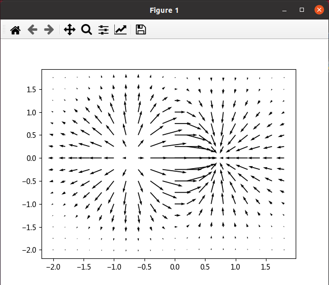

## 箱型图

```
np.random.seed(10)
collectn_1 = np.random.normal(100, 10, 200)
collectn_2 = np.random.normal(80, 30, 200)
collectn_3 = np.random.normal(90, 20, 200)
collectn_4 = np.random.normal(70, 25, 200)
data_to_plot = [collectn_1, collectn_2, collectn_3, collectn_4]
fig = plt.figure()
# 创建绘图区域
ax = fig.add_axes([0.1, 0.1, 0.8, 0.8])
# 创建箱型图
bp = ax.boxplot(data_to_plot)
plt.show()
```


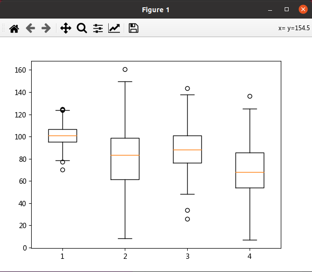

## 提琴图

```
np.random.seed(10)
collectn_1 = np.random.normal(100, 10, 200)
collectn_2 = np.random.normal(80, 30, 200)
collectn_3 = np.random.normal(90, 20, 200)
collectn_4 = np.random.normal(70, 25, 200)
#创建绘制小提琴图的数据序列
data_to_plot = [collectn_1, collectn_2, collectn_3, collectn_4]
#创建一个画布
fig = plt.figure()
#创建一个绘图区域
ax = fig.add_axes([0,0,1,1])
# 创建一个小提琴图
bp = ax.violinplot(data_to_plot)
plt.show()
```

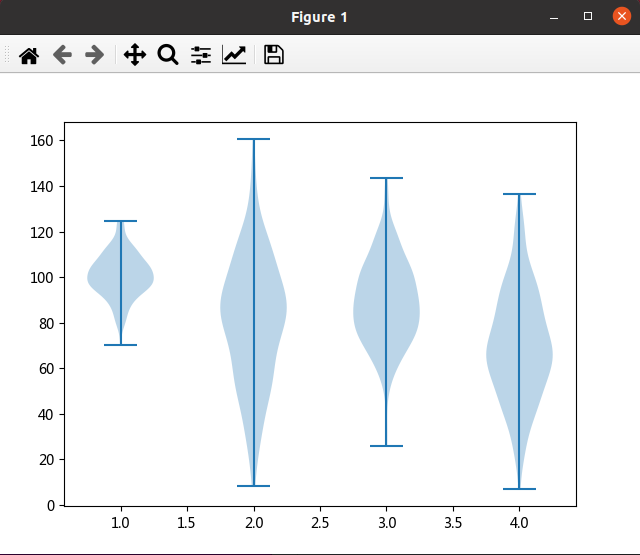

## 绘制文本

```
Matplotlib 使用pyplot模块中的 text() 函数绘制文本，函数的语法格式如下：
plt.text(x, y, string, weight="bold", color="b")
参数说明如下：
x: 注释文本内容所在位置的横坐标；
y：注释文本内容所在位置的纵坐标；
string：注释文本内容；
weight：注释文本内容的粗细风格；


plt.rcParams["font.sans-serif"]=["SimHei"] #设置字体
plt.rcParams["axes.unicode_minus"]=False #正常显示负号
fig = plt.figure()
#添加绘图区域
ax = fig.add_axes([0,0,1,1])
#设置格式
ax.set_title('axes title')
ax.set_xlabel('xlabel')
ax.set_ylabel('ylabel')
# 3,8 表示x，y的坐标点；style设置字体样式为斜体；bbox用来设置盒子的属性，比如背景色
ax.text(3, 8, 'C语言中网网，编程爱好者都喜欢的网站', style='italic',bbox = {'facecolor': 'yellow'},fontsize=15)
#绘制数学表达式,用$符包裹
ax.text(2, 6, r'an equation: $E = mc^2$', fontsize = 15)
#添加文字，并设置样式
ax.text(4, 0.05, '网址：c.biancheng.net',verticalalignment = 'bottom', color = 'green', fontsize = 15)
ax.plot([2], [1], 'o')
#xy为点的坐标；xytext为注释内容坐标；arrowprops设置箭头的属性
ax.annotate('C语言中文网', xy = (2, 1), xytext = (3, 4),arrowprops = dict(facecolor = 'blue', shrink = 0.1))
#设置坐标轴x,y
ax.axis([0, 10, 0, 10])
plt.show()
```

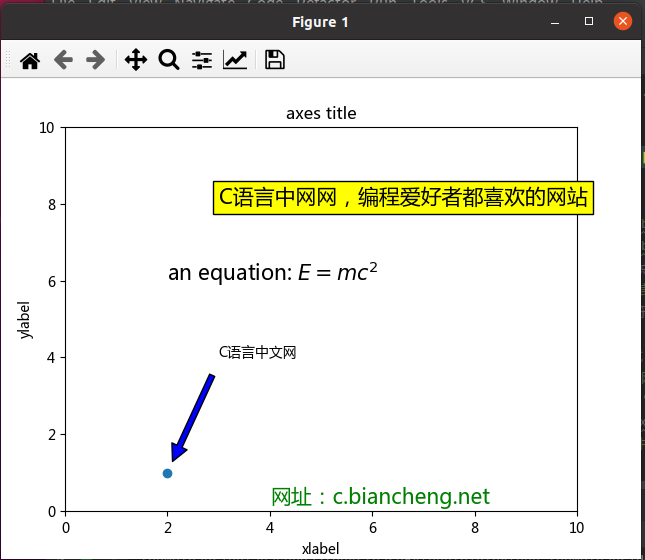

## 数学表达式

```
#数学表达式
plt.title(r'$\alpha > \beta$')

如果要绘制下标和上标，您需要使用'_'和'^'符号，下面是一个简单的示例：
#绘制表达式 r'$\alpha_i> \beta_i$'

t = np.arange(0.0, 2.0, 0.01)
s = np.sin(2*np.pi*t)
#绘制函数图像
plt.plot(t,s)
#设置标题
plt.title(r'$\alpha_i> \beta_i$', fontsize=20)
#设置数学表达式
plt.text(0.6, 0.6, r'$\mathcal{A}\mathrm{sin}(2 \omega t)$', fontsize = 20)
#设置数学表达式
plt.text(0.1, -0.5, r'$\sqrt{2}$', fontsize=10)
plt.xlabel('time (s)')
plt.ylabel('volts (mV)')
plt.show()
```

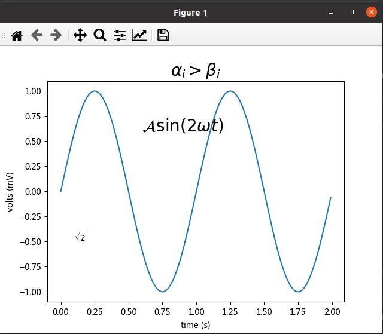

## 图像处理

```
略
```

## 3D绘图

```
略
```

## 总结

```
def test():
    x = np.linspace(-3, 3, 30)
    plt.plot(x, x ** 2, "b")
    plt.xlabel("x")
    plt.ylabel("f(x)=x^2")
    plt.title("数学图")
    plt.show()
    
def test2():
    x=np.linspace(-3,3,30)
    fig=plt.figure(figsize=(12,6))
    ax=fig.add_axes([0.1,0.1,0.8,0.8])
    ax.plot(x,x**2,"b")
    ax.set_xlabel("x")
    ax.set_ylabel("f(x)=x^2")
    ax.set_title("数学图")
    plt.show()

最基础形式:
	①.设置x的取值范围
	②.设置y=f(x)
	③.使用绘图类型函数绘制--->画
	④.设置x,y轴标签,标题
	⑤.显示
-----------------------------------------------------------------
有更特定的要求可以使用画布,axes类-->自己设置大小,显示多个图等
形式:
    ①.设置x的取值范围
	②.设置y=f(x)
	③.创建画布对象
	④.创建轴域类axes==>设置绘图区域
	⑤.使用绘图类型函数绘制--->画
	⑥.设置x,y轴标签,标题,图例(可对画布对象用,也可以对轴域类对象用)
	⑦.显示
	
注意:
在轴域类中设置x,y轴标签,标题要加set
ax.set_xlabel("x")
ax.set_ylabel("f(x)=x^2")
ax.set_title("数学图")
而是用plt模板函数则不需要,两种方式都行
-------------------------------------------------------------------------------------
设置x/y轴的名字：plt.xlabel，ax.set_xlabel。labelpad可以调整文字和坐标轴的距离
设置坐标轴刻度：plt.xticks(x,x_自定义), ax.set_xticks（设置范围）,ax.set_xticklabels（设置刻度展示文字，和xticks搭配使用）一起用。rotation可以调整文字的角度
设置title：plt.title(), ax.set_title()
设置边框的可见度
-------------------------------------------------------------------------------------
对于某些类不知道有哪些函数可以通过看库获取,先不用去网上找,效率其实不高,直接看名字有时就知道了
有关代码见./code/test.py
```

