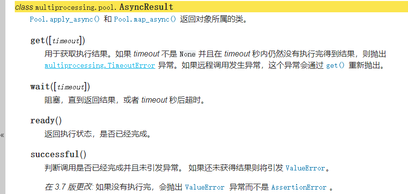

## multiprocessing.Pool

### 创建进程池

```
class  multiprocessing.Pool([processes, initializer, initargs, maxtasksperchild, context])

一个进程池对象，它控制可以提交作业的工作进程池。它支持带有超时和回调的异步结果，以及一个并行的 map 实现。

processes 是要使用的工作进程数目。如果processes 为None，则使用os.cpu_count()(https://docs.python.org/zh-cn/3.9/library/os.html#os.cpu_count) 返回的值。

如果initializer不为None，则每个工作进程将会在启动时调用initializer(*initargs)。

maxtasksperchild 是一个工作进程在它退出或被一个新的工作进程代替之前能完成的任务数量，为了释放未使用的资源。默认的maxtasksperchild是None，意味着工作进程寿与池齐。

context可被用于指定启动的工作进程的上下文。通常一个进程池是使用函数multiprocessing.Pool()或者一个上下文对象的Pool()(https://docs.python.org/zh-cn/3.9/library/multiprocessing.html#multiprocessing.pool.Pool) 方法创建的。在这两种情况下， context 都是适当设置的。

注意，进程池对象的方法只有创建它的进程能够调用。
```

### 进程池方法

```
1.apply(func[, args[, kwds]])
	使用 args 参数以及 kwds 命名参数调用 func , 它会返回结果前阻塞。这种情况下，apply_async() 更适合并行化工作。另外 func 只会在一个进程池中的一个工作进程中执行。

2.apply_async(func[, args[, kwds[, callback[, error_callback]]]])
	apply() 方法的一个变种，返回一个 AsyncResult 对象。
	如果指定了 callback , 它必须是一个接受单个参数的可调用对象。当执行成功时， callback 会被用于处理执行后的返回结果，否则，调用 error_callback 。
	如果指定了 error_callback , 它必须是一个接受单个参数的可调用对象。当目标函数执行失败时， 会将抛出的异常对象作为参数传递给 error_callback 执行。
	回调函数应该立即执行完成，否则会阻塞负责处理结果的线程。

3.map(func, iterable[, chunksize])
	内置 map() 函数的并行版本 (但它只支持一个 iterable 参数，对于多个可迭代对象请参阅 starmap())。 它会保持阻塞直到获得结果。
	这个方法会将可迭代对象分割为许多块，然后提交给进程池。可以将 chunksize 设置为一个正整数从而（近似）指定每个块的大小可以。
	注意对于很长的迭代对象，可能消耗很多内存。可以考虑使用 imap() 或 imap_unordered() 并且显示指定 chunksize 以提升效率。

4.map_async(func, iterable[, chunksize[, callback[, error_callback]]])
	map() 方法的一个变种，返回一个 AsyncResult 对象。
	如果指定了 callback , 它必须是一个接受单个参数的可调用对象。当执行成功时， callback 会被用于处理执行后的返回结果，否则，调用 error_callback 。
	如果指定了 error_callback , 它必须是一个接受单个参数的可调用对象。当目标函数执行失败时， 会将抛出的异常对象作为参数传递给 error_callback 执行。
	回调函数应该立即执行完成，否则会阻塞负责处理结果的线程。

5.imap(func, iterable[, chunksize])
	map() 的延迟执行版本。
	chunksize 参数的作用和 map() 方法的一样。对于很长的迭代器，给 chunksize 设置一个很大的值会比默认值 1 极大 地加快执行速度。
	同样，如果 chunksize 是 1 , 那么 imap() 方法所返回的迭代器的 next() 方法拥有一个可选的 timeout 参数： 如果无法在 timeout 秒内执行得到结果，则``next(timeout)`` 会抛出 multiprocessing.TimeoutError 异常。

6.imap_unordered(func, iterable[, chunksize])
	和 imap() 相同，只不过通过迭代器返回的结果是任意的。（当进程池中只有一个工作进程的时候，返回结果的顺序才能认为是"有序"的）

7.starmap(func, iterable[, chunksize])
	和 map() 类似，不过 iterable 中的每一项会被解包再作为函数参数。
	比如可迭代对象 [(1,2), (3, 4)] 会转化为等价于 [func(1,2), func(3,4)] 的调用。

8.starmap_async(func, iterable[, chunksize[, callback[, error_callback]]])¶
	相当于 starmap() 与 map_async() 的结合，迭代 iterable 的每一项，解包作为 func 的参数并执行，返回用于获取结果的对象。
	


区别：
apply、map 阻塞（同步）
apply_async、imap、map_async、imap_unordered 非阻塞（异步），返回 AsyncResult 对象，用get方法

apply、apply_async 串行
map、imap、map_async、imap_unordered 并行

apply、apply_async、map、imap、map_async有序
imap_unordered 无序


apply、apply_async 处理完一个任务，就可以得到返回结果，
map、imap、map_async、imap_unordered 关键在于chunksize的设置，这个方法会将可迭代对象分割为许多块，然后提交给进程池。chunksize为1表示处理完一个任务，就可以得到返回结果，同时任务顺序也是0，1，2，...
如果chunksize为10表示处理完十个任务，就可以得到返回结果，任务顺序可能是0，10，20...

starmap、starmap_async 解包在执行，差不多，具体看上诉介绍

推荐使用imap 如果进程没有阻塞代码，用apply_async也行
```

### 同步和异步区别

```
import multiprocessing
if __name__ == '__main__':
    with multiprocessing.Pool(processes=4) as pool:         # start 4 worker processes
        # result = pool.apply(tcp, (8080,))
        result = pool.apply_async(tcp, (8080,))
        for i in range(10):
            print(i)
        print(result.get())
        pool.close()
        pool.join()#以防主进程结束进而关闭所有子进程

用nc模拟客户端连接
nc 127.0.0.1 8080 
```

### 串行和并行区别

```
def tcp(port):
    sock = socket.socket(socket.AF_INET, socket.SOCK_STREAM)
    sock.bind(('localhost', port))
    sock.listen()

    clientsocket, address = sock.accept()
    print("连接地址: %s" % str(address))
    clientsocket.close()
    print("this is a test text.")
    return port

if __name__ == '__main__':
    with multiprocessing.Pool(processes=4) as pool:         # start 4 worker processes
        for i in range(8080,8083):
            result = pool.apply(tcp, (i,))
            print(result)

        #result = pool.map(tcp,range(8080,8083))
        #print(result)

apply只能按以下顺序运行
nc 127.0.0.1 8080
nc 127.0.0.1 8081
nc 127.0.0.1 8082

而map只要运行了下面三条命令就可以结束
nc 127.0.0.1 8081
nc 127.0.0.1 8080
nc 127.0.0.1 8082
```

### chunksize测试

```
def download_task(filename):
    # print('启动下载进程，进程号[%d].' % getpid())
    print('开始下载%s...' % filename)
    sleep(4)
    return filename

#试试1、2、10之间的差异
if __name__ == '__main__':
    start = time()
    pool = multiprocessing.Pool()
    results = pool.imap(download_task, range(1000), chunksize=1)

    for result in results:
        print(f"filename:{result}")
    end = time()
    print('总共耗费了%.2f秒.' % (end - start))
```

### AsyncResult对象



### demo

```
map_async、apply_async返回 AsyncResult 对象。

def tcp(port):
    sock = socket.socket(socket.AF_INET, socket.SOCK_STREAM)
    sock.bind(('localhost', port))
    sock.listen()

    clientsocket, address = sock.accept()
    print("连接地址: %s" % str(address))
    clientsocket.close()
    print("this is a test text.")
    return port
    
if __name__ == '__main__':
    with multiprocessing.Pool(processes=4) as pool:         # start 4 worker processes
        
        result = pool.apply(tcp, (8081,))
        print(result)
        #result = pool.map_async(tcp, (8080,))
        #result = pool.apply_async(tcp, (8080,))
        #print(result.get())

        for i in range(8080,8083):
            result = pool.apply(tcp, (i,))
            print(result)
            #result = pool.apply_async(tcp, (i,))
            #print(result.get())

        result = pool.map(tcp,range(8080,8083))
        print(result)

        result = pool.imap(tcp, range(8080, 8083),chunksize=1)
        for i in result:
            print(i)


        result = pool.map_async(tcp, range(8080, 8083))
        print(result.get())

        result = pool.imap_unordered(tcp,range(8080,8083),chunksize=10)
        for i in result:
            print(i)

        for i in range(10):
            print(i)
        pool.close()
        pool.join()
```


