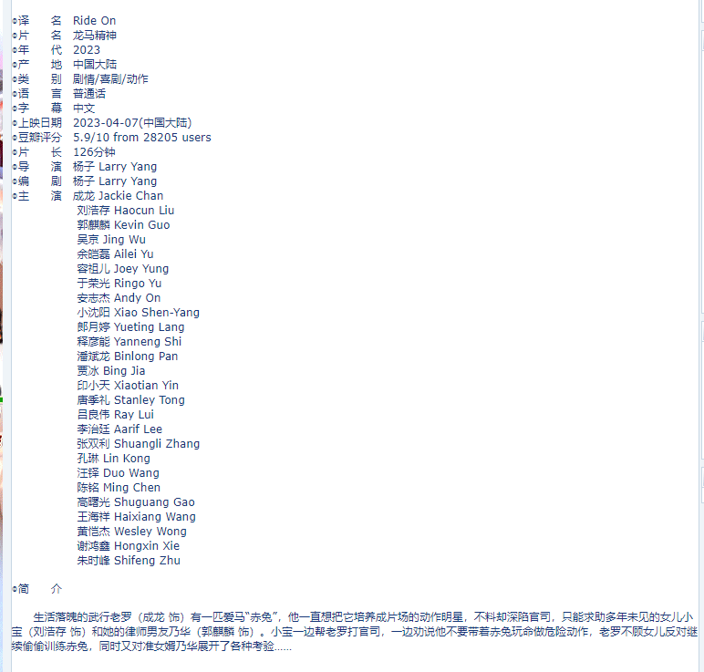
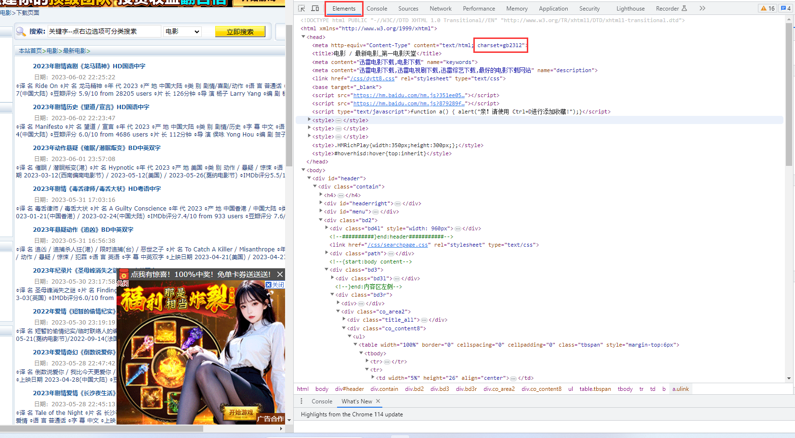
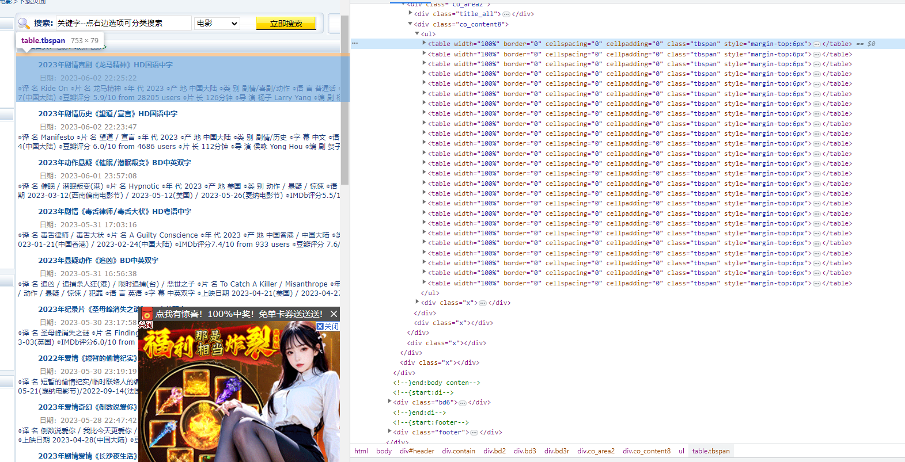
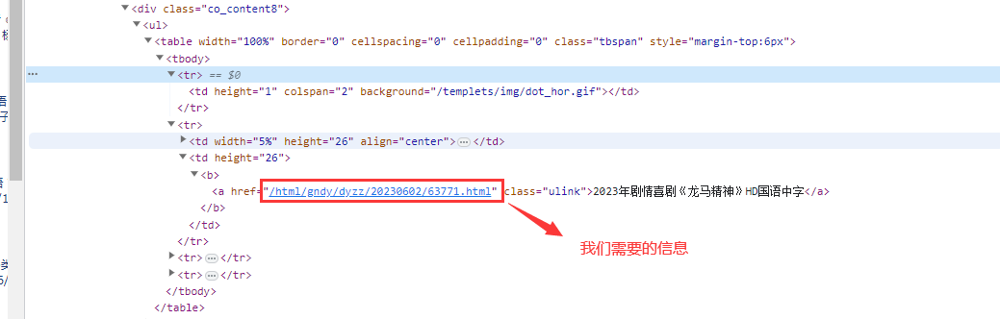
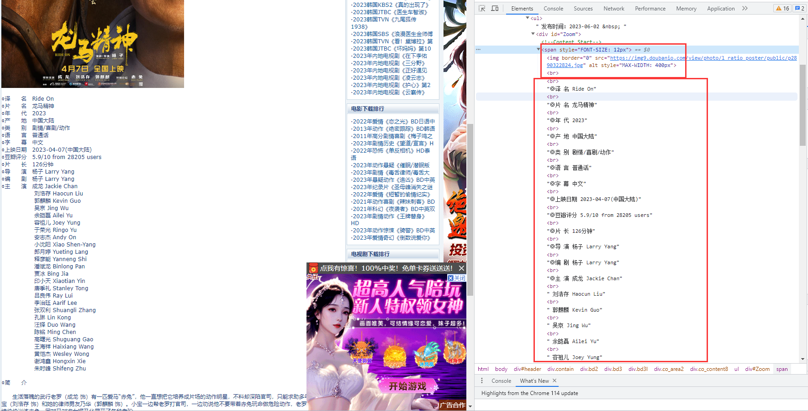
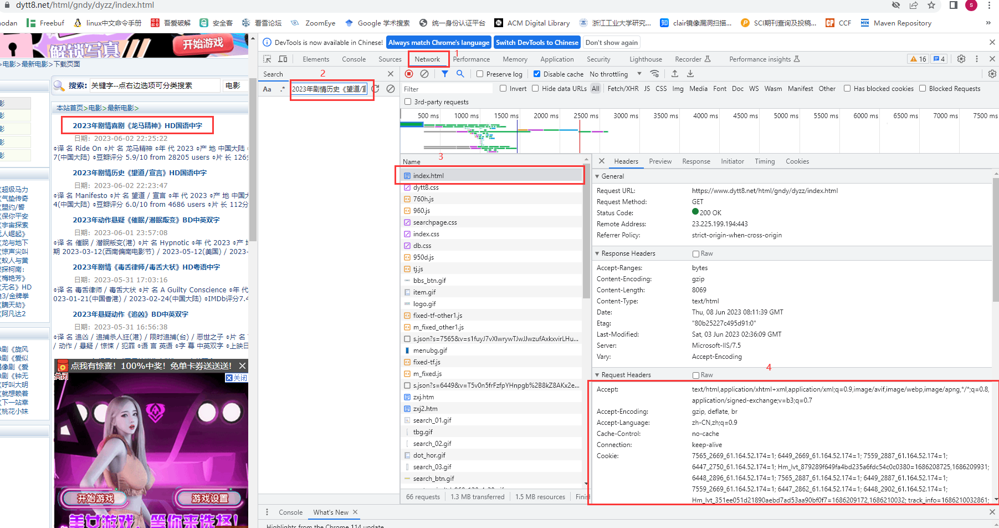

# urllib--- URL 处理模块

`urllib` 是一个收集了多个涉及 URL 的模块的包：

- [`urllib.request`](https://docs.python.org/zh-cn/3.9/library/urllib.request.html#module-urllib.request) 打开和读取 URL
- [`urllib.error`](https://docs.python.org/zh-cn/3.9/library/urllib.error.html#module-urllib.error) 包含 [`urllib.request`](https://docs.python.org/zh-cn/3.9/library/urllib.request.html#module-urllib.request) 抛出的异常
- [`urllib.parse`](https://docs.python.org/zh-cn/3.9/library/urllib.parse.html#module-urllib.parse) 用于解析 URL
- [`urllib.robotparser`](https://docs.python.org/zh-cn/3.9/library/urllib.robotparser.html#module-urllib.robotparser) 用于解析 `robots.txt` 文件


## 爬取电影天堂案例

### 1.找到要爬取的网站

```
url:https://www.dytt8.net/html/gndy/dyzz/index.html
```


### 2.确定要爬取的内容



```
点击龙马精神电影，可以看到电影信息
故我们要爬取https://www.dytt8.net/html/gndy/dyzz/index.html页面下所有电影的详细信息
```

### 3.分析页面，写出正则表达式

#### 得到网站编码

为gb2312




#### 分析一级页面，写出正则表达式






```
<table width="100%".*?<td width="5%".*?<a href="(.*?)".*?ulink">.*?</table>
```

#### 分析二级页面，写出正则表达式



```
这里假如只要前七条记录
正则表达式为
<span style="FONT-SIZE: 12px">.*?<br \/><br \/>(.*?)<br \/>(.*?)<br \/>(.*?)<br \/>(.*?)<br \/>(.*?)<br \/>(.*?)<br \/>(.*?)<br \/>
```

## 4.伪造请求头



## 5.写脚本

### 1.创建类对象

```python
class MovieSkySpider(object):
    def __init__(self):
        self.url = 'https://www.dytt8.net/html/gndy/dyzz/index.html'
```

### 2.解析一级页面，得到二级页面的url 

```
这里headers信息只使用cookie和user_Agent即可从第四步获得

    def get_secondary_url(self, url):
        headers = {
            "Cookie": "fixedview_7565=d%252BTQSdXcLi5wB7l%252BlTxnRDQZFh%252FxcvqQN6y4P6lLot3V4URXAqeSqeUS5oZsDIPNskGio%252B%252Be90IJNpB11zXxqEA3yDjtXle0B0ggbHEa7PbKMJZS8xUafmy2hye%252Fh9IfviPKojLEVbvKieKBkLEzZEoNpa7VYdrlfCl2sPviiX5P6C0NCRpLq4JW%252Fwtyb0sH%252BbbCu4xEC7ldV8Bsls0fPw0HdK%252Brt33qsi5wtvga9fvPl8lUlGL6xcEGq5wnR1HW1iS4D0YmK96jF49crCSf%252FD4EqU0Hl3%252Fk6mkd5J6%252B0JT895zVxskM0xFNd%252BBx31v6SgRTpsJSlbbQXdOpqmIvdw%253D%253D; 7565_2669_61.164.52.174=1; fixedview_6449=soyIAUzjvt%252FTkjBcGJS%252FQii6DDyzZVIo1d8DiSN4FGCwQcgFGQn6I1toECKtb4bYMz%252Fd1mbcwOpA%252FBkWBKR7QIHJVlmoyrBWxPtGCcKpvzC8%252FGJX%252BtLKJ0KI5mffcUFgq5A97BBg1bkomLo1p%252FsKE%252BMe%252FPaR%252B6kWrDpugp4NEB5hh8rGsaoGPCdNXwSjZFVlWo5KQTWGjT9uRuOcjST72B0srJIBkXYTqXDpEwZX3kQrva5lfP0aNkKSpU3BbIXZOA%252FDaWTcPI%252FhnVtoCMiapJ7CxRxGwxgN2TxN5ab4A3OgZ%252F6JeknSCq8pbbMkMfMpwR6Kv4fBVSkxd2pLtPG5pw%253D%253D; 6449_2669_61.164.52.174=1; fixedview_7559=MEbcfhffz0WRAAN%252BAQwX1fKZFU7A3X1hkvDdO99PR%252BddkstXQIB1MsGpTIsC09azAzw1U1EAvhKhQByVeo7Ar5utV12mQ6TS318nJuCujtovfT8jjmUVD1r5hqQfbAm0Fqlhz5rpuXVW2O3ekHvDl0Aa%252F2%252FO0AGMerFrVZo1W1ZCrT50SyOIIEIGIwmr%252F78csiFeSIZZa%252Fci49ZmkcM7aVzZ7qurIlzsZhPEnJant8314%252F2jVrFPi%252Bk%252Fhdl64eb%252BCRTagP%252BfGkIScJ3CjVeSFrxuc26g2IQfIgHGtNeau32xJaBVwhek1fmri24AH52nbYVoB38Yn7RFSWNPDO9xog%253D%253D; 7559_2887_61.164.52.174=1; beitouviews_6447=rlK62IQ9TgnK8PgLivyte3okuEbMI8El9ihXZo6PhCCQte%252BELVtTjAmh1kyRR31Z9GGYqKuyfOnrryz4%252Fi5JifWDXEhKj2gDs7ylxkUm8MZ6BF2yyVfhVuYP35xmXD5B%252BjMc0z0d4oaYkUjy7xlazveZxNQsocUO9%252F1HtckaVUbBliBv%252BumpCecklMCBOM9JEGnUHFTF4ECCKZpcL6Gviiiv9kazkMI%252BsT%252FbjGBt4pBs%252F0hmO4WzNXGVE5da8DXPSQm4lG173766As5Fxyfe59KcJ80MzV44XC3tySjTpWP1YCDr6JxUd4FPMCJiEWsKW9jGkHztfgLctu1uIlxsSw%253D%253D; 6447_2750_61.164.52.174=1; Hm_lvt_879289f649fa4bd235a6fdc54c0c0380=1686208725,1686209931; Hm_lpvt_879289f649fa4bd235a6fdc54c0c0380=1686209931; richviews_6448=OZCz3H7nlNmqV2eKzhk0agX0ssSXN8TLP33PsdotT0Yq%252FRwquK05rZXMAfwhRdq1MHdzxY3oCK05ojOkNoNvWgzCAwuNAf9vdZV0HwKb0%252BxXwCgDzbhVaSwUoFj%252F1lQ6A8DxtGWaFu%252F1rhK%252B9KydUgV5KSXEuqZNsVKobXJ9Gz0HnOWPrCfgNjiY9VSUspjW%252BbfGtUCtpctkxa%252FKcI0jFGKOQmhsXV0BtHlJtJY9U%252Fw75E7FVo7HT2U6J%252F0IJq9b66CNCgbW6sSSL0wnXvDIC%252B6nW2oN2%252F%252FS3K39ME30wYVWGfMtBNOYnNzv1JfwrFdrXy20xvZ8CLqIkAg9RkfPcQ%253D%253D; 6448_2896_61.164.52.174=1; 64487775961.164.52.174=%7B%224859%22%3A1%7D; sdwwqqcc=1;",
            "User-Agent": 'Mozilla/5.0 (Windows NT 10.0; Win64; x64) AppleWebKit/537.36 (KHTML, like Gecko) Chrome/113.0.0.0 Safari/537.36'
        }
        req = request.Request(url=url, headers=headers)
        res = request.urlopen(req)
        # 本网站使用gb2312的编码格式
        html = res.read().decode('gb2312', 'ignore')
        # 正则表达式
        re_bds = '<table width="100%".*?<td width="5%".*?<a href="(.*?)".*?ulink">.*?</table>'
        # 生成正则表达式对象
        pattern = re.compile(re_bds, re.S)
        r_list = pattern.findall(html)
        return r_list
```

## 3.得到二级页面URL

```python
 	def get_html(self, url):
        headers = {
            "Cookie": "fixedview_7565=d%252BTQSdXcLi5wB7l%252BlTxnRDQZFh%252FxcvqQN6y4P6lLot3V4URXAqeSqeUS5oZsDIPNskGio%252B%252Be90IJNpB11zXxqEA3yDjtXle0B0ggbHEa7PbKMJZS8xUafmy2hye%252Fh9IfviPKojLEVbvKieKBkLEzZEoNpa7VYdrlfCl2sPviiX5P6C0NCRpLq4JW%252Fwtyb0sH%252BbbCu4xEC7ldV8Bsls0fPw0HdK%252Brt33qsi5wtvga9fvPl8lUlGL6xcEGq5wnR1HW1iS4D0YmK96jF49crCSf%252FD4EqU0Hl3%252Fk6mkd5J6%252B0JT895zVxskM0xFNd%252BBx31v6SgRTpsJSlbbQXdOpqmIvdw%253D%253D; 7565_2669_61.164.52.174=1; fixedview_6449=soyIAUzjvt%252FTkjBcGJS%252FQii6DDyzZVIo1d8DiSN4FGCwQcgFGQn6I1toECKtb4bYMz%252Fd1mbcwOpA%252FBkWBKR7QIHJVlmoyrBWxPtGCcKpvzC8%252FGJX%252BtLKJ0KI5mffcUFgq5A97BBg1bkomLo1p%252FsKE%252BMe%252FPaR%252B6kWrDpugp4NEB5hh8rGsaoGPCdNXwSjZFVlWo5KQTWGjT9uRuOcjST72B0srJIBkXYTqXDpEwZX3kQrva5lfP0aNkKSpU3BbIXZOA%252FDaWTcPI%252FhnVtoCMiapJ7CxRxGwxgN2TxN5ab4A3OgZ%252F6JeknSCq8pbbMkMfMpwR6Kv4fBVSkxd2pLtPG5pw%253D%253D; 6449_2669_61.164.52.174=1; fixedview_7559=MEbcfhffz0WRAAN%252BAQwX1fKZFU7A3X1hkvDdO99PR%252BddkstXQIB1MsGpTIsC09azAzw1U1EAvhKhQByVeo7Ar5utV12mQ6TS318nJuCujtovfT8jjmUVD1r5hqQfbAm0Fqlhz5rpuXVW2O3ekHvDl0Aa%252F2%252FO0AGMerFrVZo1W1ZCrT50SyOIIEIGIwmr%252F78csiFeSIZZa%252Fci49ZmkcM7aVzZ7qurIlzsZhPEnJant8314%252F2jVrFPi%252Bk%252Fhdl64eb%252BCRTagP%252BfGkIScJ3CjVeSFrxuc26g2IQfIgHGtNeau32xJaBVwhek1fmri24AH52nbYVoB38Yn7RFSWNPDO9xog%253D%253D; 7559_2887_61.164.52.174=1; beitouviews_6447=rlK62IQ9TgnK8PgLivyte3okuEbMI8El9ihXZo6PhCCQte%252BELVtTjAmh1kyRR31Z9GGYqKuyfOnrryz4%252Fi5JifWDXEhKj2gDs7ylxkUm8MZ6BF2yyVfhVuYP35xmXD5B%252BjMc0z0d4oaYkUjy7xlazveZxNQsocUO9%252F1HtckaVUbBliBv%252BumpCecklMCBOM9JEGnUHFTF4ECCKZpcL6Gviiiv9kazkMI%252BsT%252FbjGBt4pBs%252F0hmO4WzNXGVE5da8DXPSQm4lG173766As5Fxyfe59KcJ80MzV44XC3tySjTpWP1YCDr6JxUd4FPMCJiEWsKW9jGkHztfgLctu1uIlxsSw%253D%253D; 6447_2750_61.164.52.174=1; Hm_lvt_879289f649fa4bd235a6fdc54c0c0380=1686208725,1686209931; Hm_lpvt_879289f649fa4bd235a6fdc54c0c0380=1686209931; richviews_6448=OZCz3H7nlNmqV2eKzhk0agX0ssSXN8TLP33PsdotT0Yq%252FRwquK05rZXMAfwhRdq1MHdzxY3oCK05ojOkNoNvWgzCAwuNAf9vdZV0HwKb0%252BxXwCgDzbhVaSwUoFj%252F1lQ6A8DxtGWaFu%252F1rhK%252B9KydUgV5KSXEuqZNsVKobXJ9Gz0HnOWPrCfgNjiY9VSUspjW%252BbfGtUCtpctkxa%252FKcI0jFGKOQmhsXV0BtHlJtJY9U%252Fw75E7FVo7HT2U6J%252F0IJq9b66CNCgbW6sSSL0wnXvDIC%252B6nW2oN2%252F%252FS3K39ME30wYVWGfMtBNOYnNzv1JfwrFdrXy20xvZ8CLqIkAg9RkfPcQ%253D%253D; 6448_2896_61.164.52.174=1; 64487775961.164.52.174=%7B%224859%22%3A1%7D; sdwwqqcc=1;",
            "User-Agent": 'Mozilla/5.0 (Windows NT 10.0; Win64; x64) AppleWebKit/537.36 (KHTML, like Gecko) Chrome/113.0.0.0 Safari/537.36'
        }
        req = request.Request(url=url, headers=headers)
        res = request.urlopen(req)
        # 本网站使用gb2312的编码格式
        html = res.read().decode('gb2312', 'ignore')
        self.parse_html(html)

    def parse_html(self, html):
        re_bds = '<span style="FONT-SIZE: 12px".*?<br /><br />"(.*?)"<br />"(.*?)"<br />"(.*?)"<br />"(.*?)"<br />"(.*?)"<br />"(.*?)"<br />"(.*?)"<br />.*?</span>'
        # 生成正则表达式对象
        pattern = re.compile(re_bds, re.S)
        r_list = pattern.findall(html)
        self.save_html(r_list)
        
    def save_html(self, r_list):
        # 生成文件对象
        with open('./data/dytt.csv', 'a', newline='', encoding="utf-8") as f:
            # 生成csv操作对象
            writer = csv.writer(f)
            # 整理数据
            for r in r_list:
                L=list(r)
                # 写入csv文件
                writer.writerow(L)
```


